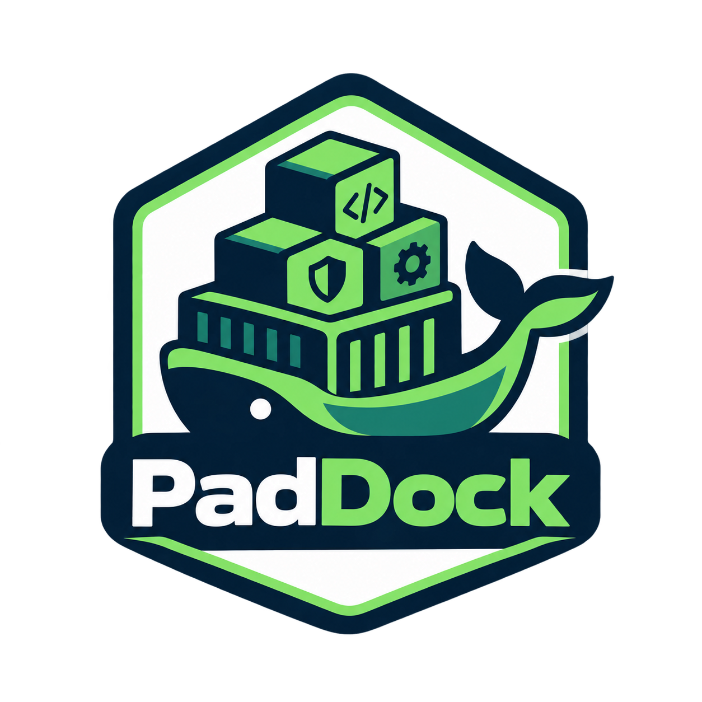

# PadDock

  

Tested, least-privilege bundles for running AI coding agents inside
[NVIDIA OpenShell](https://github.com/NVIDIA/OpenShell) sandboxes.

**Status:** early development. Not ready for use yet.

PadDock is an independent community project. It is not affiliated with or
endorsed by NVIDIA.

## Bundles

| Agent | Bundle | Auth |
|---|---|---|
| OpenCode 2.0.21 | [bundles/opencode](bundles/opencode) | OpenRouter API key |

## Layout

- `bundles/<agent>/`: one bundle per agent (image reference, sandbox policy,
  boundary policy, provider profiles, tests).
- `scripts/paddock/`: Python helpers used by CI (`python -m paddock --help`).
- `scripts/ci/`: bash scripts that run bundles against real OpenShell gateways.
- `docs/`: design spec, plans, and decision records.

## License

Apache-2.0. See [LICENSE](LICENSE) and [NOTICE](NOTICE).
